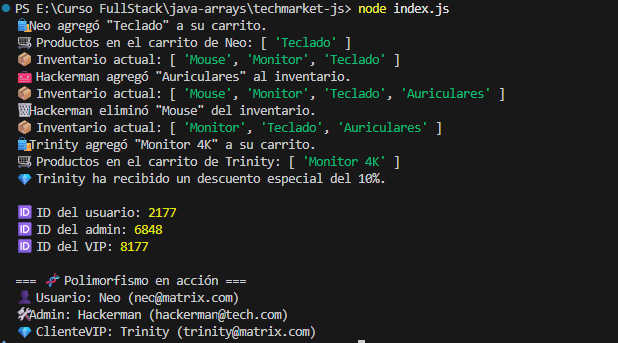

<h1 align="center">🛒 TechMarket - Sistema de Tienda Virtual (POO)</h1>

## 🎯 Descripción

Este proyecto simula una **tienda virtual**, aplicando los principios fundamentales de **Programación Orientada a Objetos (POO)** en JavaScript:

- **Clases**
- **Herencia (`extends`)**
- **Encapsulación (`#propiedadesPrivadas`)**
- **Métodos y comportamiento**
- **Polimorfismo** (Extra Opcional)

El sistema cuenta con **tres tipos de usuarios**:

| Clase | Descripción | Permite |
|------|-------------|---------|
| `Usuario` | Usuario común | Agregar productos al carrito |
| `Admin` | Usuario con permisos especiales | Gestiona inventario (agrega / elimina productos) |
| `ClienteVIP` *(opcional)* | Usuario con beneficios | Aplica descuentos especiales |

## 🧱 Clases Implementadas

### 👤 Clase `Usuario`
- `#id` privado
- Métodos principales:
  - `agregarAlCarrito()`
  - `verCarrito()`
  - `getId()`
  - `mostrarInfo()` (polimorfismo)

### 🛠️ Clase `Admin` (hereda de `Usuario`)
- Gestiona inventario
- Métodos:
  - `agregarProducto()`
  - `eliminarProducto()`
  - `mostrarInventario()`
  - `mostrarInfo()` sobrescrito

### 💎 Clase `ClienteVIP` *(Extra Opcional)*
- Método exclusivo:
  - `aplicarDescuento()`
  - `mostrarInfo()` sobrescrito

## 🧪 Ejecución

```bash
node index.js
```

## 🖼️ Ejemplo visual de ejecución

<p align="center">
  
</p>